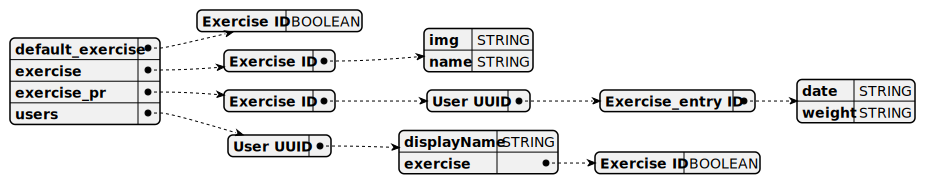
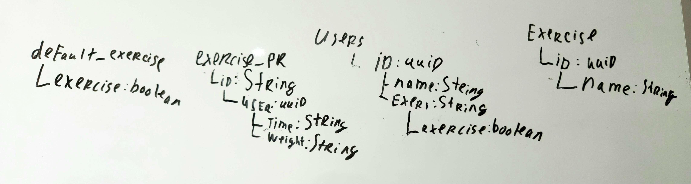

# PR tracker Android application
This is an Android Studio Kotlin project.


To run the application open in android studio, and run in an emulator.

Code files are located in 

```app\src\main\java\com\example\exercisetracker```

## Database
This application uses Firebase Realtime Database.
With the current DB structure looking like:




Or on white board:


